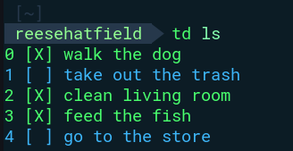

# td 
Easy to use, open source, command line productivity tool



## Usage

For usage guide, see [Docs](src/Docs.md)

## Installation

Prerequisite: [Golang](https://go.dev/doc/install)

```bash
git clone https://github.com/ReeseHatfield/td.git
cd td
chmod u+x install.sh
./install.sh
```

td should be added to your binaries and can be used with the `td` command
